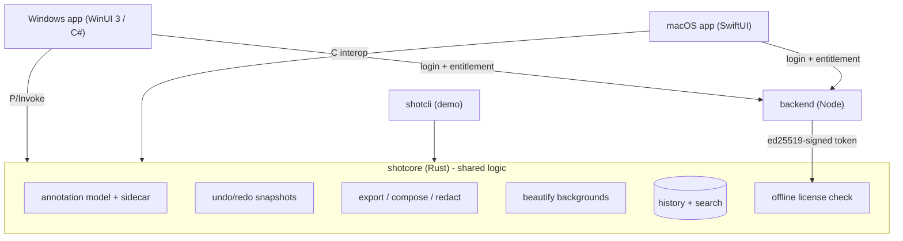

# SloerShot

[](https://github.com/norldlord34-debug/SloerShot/actions/workflows/ci.yml)


Native, on-device screenshot and annotation tooling for Windows and macOS, built
around a single shared Rust core. SloerShot pushes past the BridgeShot concept with a
richer annotation model, redaction that destroys pixels on export, background
beautify, scroll capture, on-device OCR, searchable history, and offline-validated
subscription licensing.

This repository proves the hard part end to end: the cross-platform core is fully
implemented and unit-tested, a runnable CLI exercises the whole pipeline, and a Node
backend issues subscription entitlements that the core verifies offline. Both native
UI shells are fully implemented on top of that core and built in CI: the Windows app
(WinUI 3) and the macOS app (SwiftUI) are at feature parity - uploads, after-capture /
after-upload pipeline, effects studio, configurable workflows, and global hotkeys.

## ShareX-parity features (v0.4.0+)

The Windows app (WinUI 3) covers ShareX-class power, all over the shared tested Rust core:

- Custom uploaders: paste any ShareX .sxcu config or JSON. Bodies: Multipart / Form / JSON / XML / Binary. Response syntax: `{response} {json:path} {regex:pat|n} {xml:tag} {header:name} {base64:..} {input} {filename} {random:a|b}`.
- Built-in destinations (no account needed): SloerShot backend, Imgur (anon), catbox.moe, Litterbox, 0x0.st, transfer.sh, tmpfiles.org, file.io, paste.rs. Plus FTP/FTPS and Pastebin/Bearer templates.
- After-capture / after-upload pipeline: auto copy, auto upload, open URL, QR of URL, shorten URL (is.gd / TinyURL / custom).
- Image effects (core, unit-tested): grayscale, sepia, invert, blur, sharpen, pixelate, emboss, edge detect, gamma, hue, saturation, posterize, black and white, solarize, colorize, vignette, brightness, contrast, RGB split, glow, outline, drop shadow, reflection, polaroid, slice, torn/wave edges, replace-color, image watermark, plus an Effects studio with live preview + presets.
- Tools: folder indexer (HTML/text/JSON), hash checker (MD5/SHA-1/SHA-256/SHA-512/CRC32), image splitter, text uploader, QR generator, screen color picker, screen ruler, external actions (run a program on the capture), thumbnailer.
- Workflows: define capture workflows with their own global hotkey and auto-copy/upload.
- Single instance: a second launch forwards its command-line args to the running instance.

### Global hotkeys
`Ctrl+Shift+4` area, `Ctrl+Shift+5` window, `Ctrl+Shift+6` fullscreen, `Ctrl+Shift+2` record, `Ctrl+Shift+U` upload last, plus the configurable primary hotkey and per-workflow hotkeys.

### Command line
- `SloerShot.exe --capture area|window|full` (alias `-c`)
- `SloerShot.exe --record` (alias `-r`)
- `SloerShot.exe --upload <file>` (alias `-u`)
- `SloerShot.exe <image-file>` opens it in the editor

macOS (SwiftUI) shares the same core and is at parity with the Windows app: the upload engine (URLSession) with the same built-in destinations, the after-capture / after-upload pipeline (auto copy/upload, open URL, QR, is.gd / TinyURL shortening), the Effects studio with live preview + presets, configurable Workflows, and global hotkeys (Carbon), plus the File Hashes / QR / Folder Index / Split tools from the menu bar.

## Quickstart
```
git clone https://github.com/norldlord34-debug/SloerShot.git
cd SloerShot

# Core: run the tests and the end-to-end demo
cargo test -p shotcore
cargo run -p shotcli -- demo --out assets/out

# Backend: install + test (share + upload-engine + auth/Stripe smoke tests)
npm install --prefix backend; npm test --prefix backend

# Windows GUI (needs the .NET SDK + Windows App SDK)
cargo build -p shotcore --release
dotnet build apps/windows/SloerShot.App/SloerShot.App.csproj -c Debug

# macOS GUI (needs a Mac with Xcode): build the core, then swift build in apps/macos
```

## Status at a glance

| Component | Language | State | Verified in this build |
| --- | --- | --- | --- |
| shotcore (shared core) | Rust | Implemented | 382 unit + 1 integration test pass |
| shotcli (demo CLI) | Rust | Implemented | Full pipeline demo + 25-module parity demo (incl. QR round-trip) |
| backend (auth + entitlements) | Node | Implemented | 49 tests pass (share + upload engine + login + Stripe webhook); tokens verified by the core |
| Windows app | C# / WinUI 3 | Builds + runs | capture->annotate->effects->save UI; launches here (window verified); binding/capture/parser verified by the smoke test, fx verified via P/Invoke; built in CI |
| macOS app | Swift / SwiftUI | Builds in CI | swift build -c release on the GitHub Actions macOS runner (green); at feature parity with Windows |

The Windows shell now builds here: the WinUI 3 app compiles with the .NET SDK and
Windows App SDK 1.6, and the C# to Rust binding is verified end to end by a runnable
console smoke test (apps/windows/SloerShot.Smoke). Frozen-screen capture (GDI) and multi-monitor enumeration are implemented and
verified; the annotation canvas (renders the core render_json and forwards pointer events to the editor handle) is implemented and compiles; its parser is verified by the smoke test. The Windows app launches and runs in this environment, and now includes an Effects toolbar (the core fx module) wired to shotcore_fx_apply over the C ABI. The macOS shell is code-ready and compiles on a
Mac with Xcode (not built in this environment).

## Repository layout

```
sloershot/
 Cargo.toml Rust workspace
 core/shotcore/ shared core library (Rust)
 src/ geometry, model, sidecar, undo, hit, export,
 beautify, ocr, history, license, stitch, video,
 editor, detect, pin, fx, ffi
 include/shotcore.h canonical C ABI header
 apps/cli/ shotcli demo binary (Rust)
 apps/windows/ WinUI 3 app (C#) - full app, builds in CI
 apps/macos/ SwiftUI app (Swift) - full app, builds in CI
 backend/ Node service: auth, Stripe, entitlements
 assets/out/ demo artifacts produced by shotcli
```

## Architecture



All capture, annotation, OCR, and image work happens on-device. The backend only
handles accounts, Stripe subscriptions, and issuing signed entitlements; the apps
validate those entitlements offline against an embedded ed25519 public key.

## The core (shotcore)

Pure Rust, no native UI dependencies. Modules:

- geometry: multi-monitor virtual desktop, logical/physical (HiDPI) mapping, selection resolve.
- model: the document, nine tools (arrow, rectangle, ellipse, line, freehand, text, numbered counter, highlighter, redact), layers, colors.
- sidecar: non-destructive JSON saved next to the image; reopen and keep editing.
- undo: snapshot-based undo/redo for every change.
- hit: hit-testing and move/resize transforms for the editor canvas.
- export: rasterize annotations onto a copy of the image; redact destroys pixels (blur or pixelate) on export.
- beautify: padded solid or gradient backgrounds, rounded corners, drop shadow, seven presets (Indigo, Sunset, Ocean, Forest, Candy, Midnight, Graphite).
- ocr: cross-platform OCR result model (words, lines, boxes) plus text extraction and search.
- history: searchable capture index (path, OCR text, tags).
- license: ed25519 entitlement issue and offline verify, with a grace window.
- stitch: overlap detection and vertical stitching for scroll capture.
- video: animated, looping GIF encoding in pure Rust, plus a VideoSink trait that native MP4 encoders (Media Foundation, VideoToolbox) implement.
- editor: a shared interaction controller (tool state, drag-to-draw, click-to-place text/counter, select/move/resize via handles, delete, reorder, live preview, undo/redo) that both native canvases drive identically.
- detect: on-device sensitive-data detection (email, credit card via Luhn, phone, IPv4, API key/token) that auto-redacts the matching OCR word boxes.
- pin: a pin board for floating screenshots above windows (geometry, opacity, z-order, lock, persistence); the native shell owns the always-on-top window.
- fx: image effects matching the competition - crop, rotate, flip, resize/scale, grayscale, sepia, invert, brightness, contrast, blur, vignette, border, spotlight, watermark, eyedropper, and JPEG-quality export. Exposed over the C ABI via shotcore_fx_apply (JSON-described ops) and wired into the Windows Effects toolbar.
- qrcode: pure-Rust QR code generator AND scanner (encode + decode with Reed-Solomon error correction, versions 1-3). SloerShot reads and writes QR codes on-device with no native dependency.
- recordcompose: screen-recording engine - animated click rings, cursor highlight, keystroke/webcam overlay placement, fps frame scheduler, and the m:ss menu-bar label (native recorder composites with these).
- magnifier: advanced-capture HUD - crosshair guides, magnifier loupe (NxN upscale), pixel + region eyedropper readouts, and PixelSnap tolerance matching.
- ocrflow: text-recognition flow - region-restricted extraction in reading order plus clipboard formatting over the OS OCR engine output.
- cloud: CleanShot-Cloud share client logic - builds the /v1/share request and resolves the response into an absolute share link.
- phash: perceptual image hashing (average + difference hash, 64-bit, Hamming distance) for near-duplicate detection and find-similar in the capture history.
- palettegen: dominant-color extraction (median-cut quantization) to suggest a matching gradient background from a screenshot.
- imagediff: before/after change detection - changed-pixel count, percentage, and the bounding box of the change (tutorials, QA, change tracking).
- edges: Sobel gradient edge map + strong-edge count for auto-annotation, smart selection, and guide detection.
- segment: connected-components labeling - bounding boxes of distinct foreground regions for click-to-select-element and auto-annotation.
- analyze: Otsu adaptive thresholding + binarization, and horizontal/vertical guide-line detection (edge-density peaks) for auto-guides and table-grid hints.
- ean13: pure-Rust EAN-13 1D barcode generator AND scanner (encode + decode with mod-10 checksum), complementing the QR codec.
- hough: Hough-transform straight-line detection (dominant line angles/offsets) for guide and table-grid hints.
- deskew: auto-straighten tilted captures - estimates the skew angle (projection-profile) and rotates the image level.
- corners: Harris corner detection (corner points) for perspective/crop hints and snapping to element corners.
- perspective: 4-point homography unwarp - flattens a tilted document/region to an axis-aligned rectangle (pairs with corners for a document scanner).
- sharpen: unsharp-mask sharpening (+ the box blur it builds on) to crisp up scaled or soft captures.
- docdetect: automatic document-quadrilateral detection (no manual corners) - pairs with perspective for a one-tap document scanner.
- whitebalance: gray-world white balance + per-channel auto-contrast for color correction.
- pdf: multi-page PDF export embedding captures as JPEG image XObjects (pure-Rust PDF writer).
- ffi: the C ABI (JSON in, JSON or status codes out) consumed by both native shells, including an opaque stateful editor handle, on-device auto-redaction, and shotcore_fx_apply for JSON-described image effects.

## Build and test

Prerequisites: a Rust toolchain (stable). Node 18+ for the backend.

```
# Run the full core test suite (380+ unit tests + 1 integration test)
cargo test -p shotcore

# Run the end-to-end demo; writes artifacts into assets/out/
cargo run -p shotcli -- demo --out assets/out
# Showcase the 18 newest parity modules (objdetect, measure, table, recognize, ...)
cargo run -p shotcli -- parity

# Build the native core library the apps link against
cargo build --release -p shotcore # produces target/release/shotcore.dll (or .dylib / .so)

# Start the backend, then issue and verify an entitlement
npm install --prefix backend
# Run the backend test suite (share + upload engine + login + Stripe webhook; 49 checks)
npm test --prefix backend
node backend/src/server.js
```

The demo prints a summary and writes base.png, annotated.png, beautified.png, the
JSON sidecar, history.json, and an animated demo.gif. Backend-issued tokens can be checked against the
core with: cargo run -p shotcli -- verify-license --pubkey HEX --token TOKEN --now UNIXTIME

## Native shells

Both shells include a complete binding layer to the core and full feature UIs, and
both build in CI. On Windows, capture, the annotation canvas, the effects toolbar, the
upload engine, workflows, and the fullscreen color-picker / ruler overlays are
implemented and the app runs; macOS is at parity and builds on the GitHub Actions macOS runner.

- Windows (apps/windows/SloerShot.App): WinUI 3 on .NET 8. Interop/ShotCore.cs wraps
    the full C ABI (stateless calls plus a stateful editor handle) via P/Invoke. Capture/FrozenScreenCapture.cs implements GDI frozen-screen capture and NativeScreen.cs enumerates monitors (both verified by the console smoke test). Editor/AnnotationCanvas.cs renders the core render_json as XAML shapes and forwards pointer events to the shared editor handle; Editor/AnnotationParser.cs (verified by the smoke test) parses it. MainWindow wires a full capture -> annotate -> apply effects -> save (flatten via the core) flow, with an Effects toolbar (grayscale, sepia, invert, blur, vignette, brighten, contrast, rotate, flip, border, spotlight) calling shotcore_fx_apply on the captured image. The .csproj copies
    shotcore.dll next to the executable. Build (verified here): dotnet build apps/windows/SloerShot.App/SloerShot.App.csproj -c Debug. The console smoke test apps/windows/SloerShot.Smoke P/Invokes the core and is the runnable proof the binding works on Windows.
- macOS (apps/macos): SwiftPM package. Sources/CShotCore exposes the C header to
    Swift; Sources/SloerShot/ShotCore.swift + ShotCoreExtras.swift wrap the full C ABI; ContentView shows the
    core version. Capture (ScreenCaptureKit/SCScreenshotManager), the annotation canvas, an area-selection overlay, the 9-tool editor, and a MenuBarExtra app are implemented (apps/macos/Sources/SloerShot/*.swift); verify on a Mac with swift build or Xcode. Native feature controllers RecordingController.swift (ScreenCaptureKit + AVAssetWriter), OcrService.swift (Vision), PinPanel.swift (always-on-top NSPanel) and CloudClient.swift (URLSession) call the shared core, matching the Windows controllers. Scanner.swift chains corners + perspective unwarp to auto-flatten documents, scans QR/EAN-13, and sharpens - all via the shared core. Build: swift build, or open
    in Xcode for a full app bundle. The macOS app is built in CI (swift build -c release)
    on the GitHub Actions macOS runner and is at feature parity with the Windows app.

## Backend

Node service (backend/) issuing ed25519-signed entitlements that match the core
validator byte for byte. Endpoints: GET /health, GET /v1/public-key, POST
/v1/auth/login (stub), POST /v1/entitlement, POST /v1/stripe/webhook (HMAC-SHA256
signature check), POST /v1/upload (binary image hosting) + GET /f/:name, and the
/v1/share link endpoints. The signing key is generated and persisted on first run under
backend/keys/ (git-ignored). The upload path is smoke-tested end to end in CI
(backend/scripts/test-upload-http.js).

Security notes:

- The login endpoint verifies SHA-256 hashed credentials (auth.js, via SLOERSHOT_USERS_JSON);
    swap the env-var store for a real database before deployment - the verify logic is unchanged.
- The backend exposes network endpoints for auth, payments, and entitlements.
    Terminate TLS in front of it, validate Stripe webhook signatures (supported), and
    keep the ed25519 private key secret. Only the public key ships in the apps.
- Entitlements are signed, not encrypted: do not place secrets in claims.

## Task to deliverable map

| Plan task | Delivered as |
| --- | --- |
| Foundations + Rust bridge | workspace, shotcore crate, C ABI, shotcore.h |
| Frozen-screen capture, multi-display, HiDPI | core geometry + resolve_selection; native capture stub |
| Non-destructive editor (9 tools, layers, undo) | model + sidecar + undo + hit |
| Export / flatten with real redaction | export (pixel-destroying blur and pixelate) |
| Beautify | beautify (7 presets, padding, corners, shadow) |
| OCR + smart redaction | ocr model + search; detect auto-redacts emails, cards, phones, IPs, and keys |
| Pin to screen + history | pin board (geometry, opacity, z-order, lock, persistence) + searchable history store |
| Scroll / long capture | stitch (overlap detection + vertical stitch) |
| Accounts + subscription + entitlements | backend + license (offline verify) |
| Video / GIF | GIF implemented in core (animated, looping); MP4 via the VideoSink trait |

## Competitor feature matrix

Synthesized from the public 2026 feature pages of ShareX, CleanShot X, Snagit,
Greenshot, and Flameshot. The SloerShot column marks capability present in the
shared Rust core (test-verified); native UI wiring varies by platform.

| Capability | SloerShot | ShareX | CleanShot X | Snagit | Greenshot |
| --- | --- | --- | --- | --- | --- |
| Region / window / fullscreen capture | Yes | Yes | Yes | Yes | Yes |
| Frozen-screen selection | Yes | - | Yes | - | - |
| Multi-monitor + HiDPI mapping | Yes | Yes | Yes | Yes | Yes |
| Scrolling / long capture | Yes | Yes | Yes | Yes | - |
| Non-destructive sidecar editing | Yes | - | - | ~ | - |
| 9 annotation tools + snapshot undo | Yes | Yes | Yes | Yes | Yes |
| Numbered step counters | Yes | Yes | Yes | Yes | - |
| Redaction that destroys pixels | Yes | Yes | Yes | Yes | Yes |
| Smart auto-redaction (emails/cards/keys) | Yes | - | - | - | - |
| Spotlight / focus dim | Yes | ~ | Yes | Yes | - |
| Beautify backgrounds (gradient + shadow) | Yes | - | - | - | - |
| Image effects (crop/rotate/flip/filters/border/vignette) | Yes | Yes | ~ | Yes | ~ |
| On-device OCR | Yes | Yes | Yes | Yes | - |
| QR code generate + scan | Yes | Yes | scan only | - | - |
| GIF / video | Yes (GIF; MP4 via sink) | Yes | Yes | Yes | - |
| Searchable history | Yes | Yes | Yes | Yes | - |
| Color picker / eyedropper | Yes | Yes | - | - | - |
| Multi-format export (PNG, JPEG quality) | Yes | Yes | Yes | Yes | Yes |
| Offline subscription licensing (ed25519) | Yes | Free | Paid | Paid | Free |
| One shared core across Windows + macOS | Yes | Win only | Mac only | Win+Mac | Win only |


1. Implement frozen-screen capture per platform and feed bytes into the editor.
2. Build the annotation canvas on top of the model, undo, and hit-testing.
3. Wire native OCR (Windows.Media.Ocr, Apple Vision) into the ocr model.
4. Wire native MP4 recording into the VideoSink trait (animated GIF already works).
5. Replace the backend login stub and deploy behind TLS with a real datastore.

## License

Proprietary. All processing is on-device; nothing leaves the machine except
optional account and entitlement calls to the backend.
